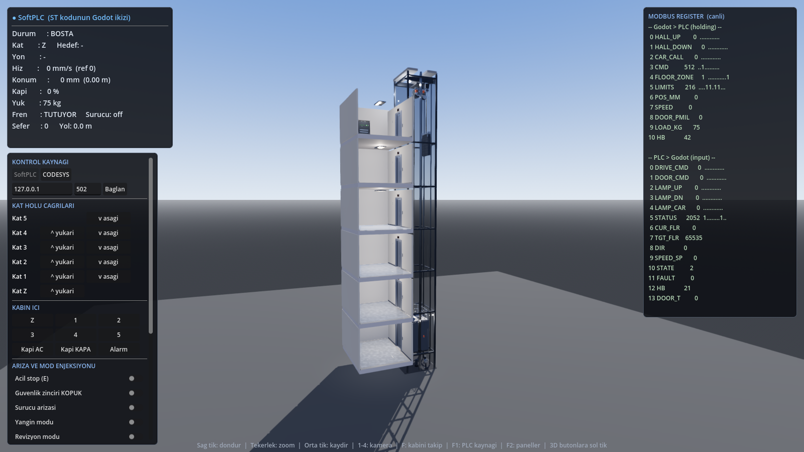
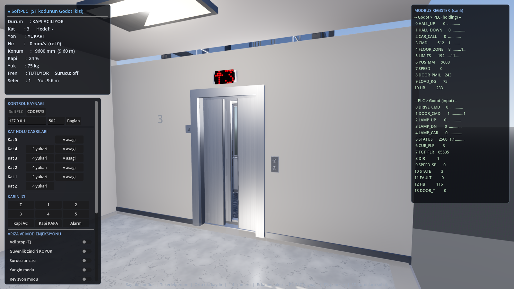
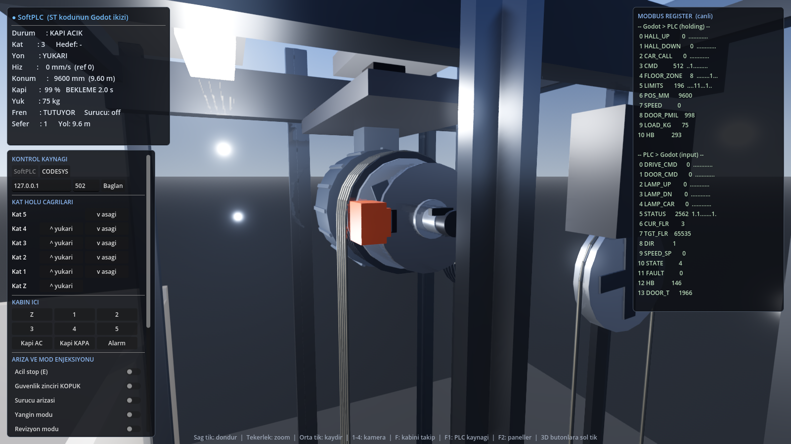

# Asansör Dijital İkiz — CODESYS + Godot

[](https://github.com/ErdemSabriVeli/elevator-digital-twin/actions/workflows/tests.yml)
[](LICENSE)
[](https://godotengine.org)
[](https://www.codesys.com)

6 katlı bir asansörün dijital ikizi. **Kontrol mantığı CODESYS'te Structured Text ile**,
**tesis (kabin, kapı, kuyu, sensörler) Godot 4'te 3B olarak** modellenmiştir. İkisi
**Modbus TCP** üzerinden gerçek bir PLC–saha ilişkisi gibi konuşur.

Aynı kontrol mantığı ayrıca GDScript'e birebir çevrilmiştir (`SoftPlc.gd`), böylece
CODESYS kurulu olmadan da proje tam çalışır ve iki uygulama karşılaştırılabilir.

```
┌────────────────────────┐   Holding Reg (FC16)   ┌────────────────────────┐
│  GODOT 4  — tesis      │  ───────────────────>  │  CODESYS — kontrol     │
│  kabin/kapı fiziği     │   butonlar, encoder,   │  FB_LiftCore (ST)      │
│  kat sensörleri        │   kat sensörü, limit   │  FSM + dispatcher      │
│  3B görselleştirme     │  <───────────────────  │  kapı + hareket + emn. │
│  operatör arayüzü      │   Input Reg (FC04)     │                        │
└────────────────────────┘   sürücü/kapı komutu   └────────────────────────┘
                             lamba, gösterge
```

---

## Ekran görüntüleri

Tüm geometri, dokular ve sesler çalışma anında kodla üretilir — depoda tek bir
model, doku veya ses dosyası yoktur.

| | |
|---|---|
|  |  |
| 6 katlı kuyu kesiti, kabin, karşı ağırlık ve halatlar | Paslanmaz söve, kat kapıları, kırmızı nokta-matris gösterge |
|  |  |
| COP: braille'li yuvarlak butonlar, çağrı kayıtlıyken amber halka | Dişlisiz PM motor, kanallı tahrik kasnağı, fren kaliperi, 5 halat |

Sol üstteki panel canlı PLC durumunu, sağdaki tablo ise **her iki yöndeki
Modbus register'larını** anlık gösterir — yani ekranda gördüğünüz her şey
gerçek kumanda verisidir.

---

## Hızlı başlangıç (CODESYS olmadan)

Godot 4.4+ gerekir, başka bağımlılık yoktur. (Proje 4.4.1 üzerinde geliştirildi
ve test edildi; CI de bu sürümü kullanır.)

**Projeyi açmak:** Godot açılış ekranında **Import** → bu depodaki
`godot/project.godot` dosyasını seç → **Import & Edit**. Ya da doğrudan:

```bash
godot --editor --path godot
```

> **Editörde sahne boş görünür — bu normaldir.** `Main.tscn` içinde tek bir
> `Node3D` vardır; kuyu, kabin, kat holleri, tahrik makinesi, halatlar ve
> arayüz dahil **her şey çalışma anında kodla üretilir** (`Main.gd → _ready()`).
> Asansörü görmek için **F5** ile çalıştırın.

Editörü hiç açmadan doğrudan çalıştırmak için:

```bash
godot --path godot
```

Proje **SoftPLC** modunda açılır — ST kodunun GDScript ikizi çalışır. Kat
holündeki ya da kabin içindeki 3B butonlara sol tıklayın, ya da soldaki
panelden çağrı verin. **F12** ekran görüntüsü alır.

## CODESYS'e bağlama

`docs/codesys-kurulum.md` adım adım anlatır. Özet:

1. CODESYS'te yeni proje → POU'ları `codesys/*.st` dosyalarından oluştur.
2. Cihaza **Ethernet → Modbus TCP Slave Device** ekle (port 502).
3. `GVL_IO` içindeki `%IW0` / `%QW0` adreslerini kendi projendekilerle eşle.
4. PLC'yi indir ve çalıştır.
5. Godot'ta HUD → **KONTROL KAYNAGI → CODESYS** → IP yaz → **Baglan**.
   (F1 tuşu SoftPLC ↔ CODESYS arasında geçiş yapar.)

Komut satırından doğrudan bağlı başlatmak için:

```bash
godot --path godot -- --plc modbus --host 192.168.1.10 --port 502
```

---

## Klasörler

| Yol | İçerik |
|---|---|
| `codesys/` | Structured Text kaynakları (kontrol mantığının aslı) |
| `godot/scripts/` | 3B tesis modeli, fizik, Modbus istemcisi, ST ikizi |
| `godot/tests/` | ST denetimi, eşleşme, geometri, senaryo ve protokol testleri |
| `docs/` | I/O haritası, CODESYS kurulumu, test senaryoları |

### CODESYS POU'ları

| Dosya | Görev |
|---|---|
| `DUT_Types.st` | Enum ve struct tanımları |
| `GVL_Config.st` | Tesis parametreleri (kat sayısı, hız, süreler) |
| `GVL_IO.st` | Modbus register alanı + uygulama struct'ları |
| `FUN_Bits.st` | `F_GetBit` / `F_SetBit` |
| `FB_CallRegistry.st` | Çağrı latch'i, lamba çıkışları |
| `FB_Dispatcher.st` | Toplamalı kumanda — hedef kat seçimi |
| `FB_DoorCtrl.st` | Kapı alt durum makinesi, foto bariyer, nudge |
| `FB_Motion.st` | Hız profili, seviyeleme, kat takibi |
| `FB_Safety.st` | Güvenlik zinciri, arıza kodları, reset |
| `FB_LiftCore.st` | Ana durum makinesi (15 durum) |
| `PLC_PRG.st` | Modbus ↔ struct dönüşümü + çevrim |

### Godot script'leri

| Dosya | Görev |
|---|---|
| `Config.gd` | Ortak sabitler — `GVL_Config.st` ile birebir aynı olmalı |
| `IoMap.gd` | Register/bit haritası — `GVL_IO.st` ile aynı |
| `SoftPlc.gd` | ST kodunun birebir GDScript ikizi |
| `Plant.gd` | Fizik modeli: kabin, kapı, encoder, sensörler |
| `ModbusTCPClient.gd` | Bloklamayan Modbus TCP master (FC3/4/6/16) |
| `PlcLink.gd` | SoftPLC ↔ CODESYS seçici, kopukluk yedeği |
| `ShaftBuilder.gd` | Kuyu, kat holleri, kat kapıları, tahrik makinesi |
| `CarRig.gd` | Kabin, kabin kapısı, kumanda paneli |
| `MaterialLib.gd` | Malzemeler, prosedürel dokular, mesh/yay yardımcıları |
| `LedDisplay.gd` | Kırmızı nokta-matris gösterge (kabin + her kat) |
| `Button3D.gd` | Tıklanabilir ışıklı buton |
| `CameraRig.gd` | Dış / kabin içi / hol / makine kameraları |
| `Hud.gd` | Durum paneli, canlı register tablosu, arıza enjeksiyonu |
| `AudioRig.gd` | Prosedürel ses sentezi (makine, kapı, gong, alarm, fren) |

---

## Modellenen davranış

**Kumanda:** toplamalı (collective) kumanda — gidiş yönündeki çağrılar sırayla
toplanır, yön bitince ters yöne dönülür. Boşta 30 s sonra park katına iner.

**Hareket:** VVVF sürücü referansı üretilir. Nominal 1600 mm/s, 2000 mm kala
yavaşlama rampası, door-zone içinde 150 mm/s sürünme hızı, ±8 mm toleransla durma.

Tesis tarafında sürücü **jerk sınırlı (S-eğrisi)** bir profil uygular: ivme bir
anda değil, sınırlı bir hızla (1300 mm/s³) değişir. Gerçek asansörlerde
kalkış ve durușun yumuşak hissedilmesinin sebebi budur. İki mühendislik
kuplajı bunun sonucudur ve ikisi de kodda açıkça belirtilmiştir:

- Yavaşlama mesafesi (`C_DECEL_DIST_MM`) sürücünün jerk sınırlı durma
  mesafesine göre boyutlandırılır — 1400 mm ile kabin katı 152 mm aşıyordu.
- Jerk sınırı bir **konfor** kısıtıdır; sürünme hızında gevşetilir, yoksa
  kabin kat seviyesi etrafında salınır.

Fren bir sürtünme elemanı olarak modellenir: hızı sıfıra çeker ve orada
bırakır, kabini ters yöne süremez. Fren komuta 150 ms gecikmeyle tepki verir.

**Kapı:** açılma → bekleme (kabin çağrısında 4 s, hol çağrısında 3 s) → kapanma.
Foto bariyer veya kapı-aç butonu kapıyı geri açar; aşırı yük kapıyı açık tutar.
15 s sonra "nudge" (yavaş zorlamalı kapama) devreye girer. Kanatlar kapalı/açık
uçlarda yavaşlayan, ortada hızlanan bir hız zarfıyla sürülür — gerçek kapı
operatörü de mekaniği korumak ve çarpmayı önlemek için böyle davranır.

**Güvenlik:** acil stop, güvenlik zinciri, uç limit switch'leri, kapı kilidi
kaybı, kapı/hareket zaman aşımı, encoder–kat sensörü uyuşmazlığı ve ayrıca:

- **Aşırı hız (regülatör):** gerçek hız anma hızının %115'ini (1840 mm/s)
  0.3 s boyunca aşarsa devreye girer. Kuyudaki mekanik regülatör modelinin
  mantık tarafındaki karşılığıdır.
- **Fren geri beslemesi:** PLC'nin fren-çöz komutu ile sahadan gelen fren
  kontağı 1 s boyunca uyuşmazsa arıza verir. Tesis modelinde fren komuta
  150 ms gecikmeyle tepki verir, yani denetim gerçek bir gecikmeyi tolere eder.

Arıza kalıcıdır, sebebi ortadan kalkmadan reset kabul edilmez.

**Alarm zili:** kabin alarm butonu anlık gelir; zil basıldıktan sonra 2 s daha
çalar (ST tarafında `TOF`, ikizde eşdeğer sınıf). Butonun halkası çaldığı
sürece yanar.

**Özel modlar:** yangın (tüm çağrılar silinir, tahliye katına inilir, kapı açık kalır),
revizyon (kabin üstü tut-bas kumandası, 300 mm/s), aşırı yük (kalkış kilidi).

**Bağlantı gözetimi:** Godot her çevrimde heartbeat gönderir. 2 s güncellenmezse PLC
güvenlik zincirini açık sayar ve asansörü hareket ettirmez.

---

## Görsel model

Kabin ve kat cepheleri modern bir asansöre göre modellenmiştir; tüm geometri ve
dokular çalışma anında kod ile üretilir (harici varlık dosyası yoktur).

**Malzemeler** — `MaterialLib.gd`
- Fırçalanmış paslanmaz (satine inox): metalik 0.96, prosedürel *roughness*
  dokusuyla ince tek yönlü fırça izi. Kabin duvarları, kapılar, söveler, COP plakası.
- Ayna: kabin arka duvarında, hafif yeşil cam tonu, kabin içi yansıma probuyla
  gerçek yansıma.
- Koyu granit kabin zemini ve açık mermer kat holü zemini: benek/damar dokusu
  prosedürel üretilir.

**Kabin içi**
- 900 mm'de yuvarlak paslanmaz küpeşte (arka + iki yan), paslanmaz süpürgelik
- Beyaz asma tavan, 4 gömme spot (her biri kendi ışığıyla) ve çevre ışık bandı
- Yan duvarlarda derz çizgili paneller

**COP (kabin kumanda paneli)** — sağ ön dönüş duvarında
- Üstte kırmızı nokta-matris gösterge, altında aşırı yük ikaz şeridi
- İki kolon yuvarlak buton (aşağıdan yukarı Z→5), her birinin yanında braille
- Kapı aç / kapı kapa / alarm, anahtarlı şalter, acil telefon ızgarası
- Kabin kapasite plakası (630 kg / 8 kişi)

**Butonlar** — `Button3D.gd`
- Paslanmaz bilezik + hafif gömülü fırçalanmış kapak + kazınmış rakam
- Çağrı kaydedildiğinde kapağı çevreleyen hale **amber** yanar (PLC lamba biti)
- Fareyle üzerine gelince soğuk gri ön izleme, tıklamada basılma hareketi

**Göstergeler** — `LedDisplay.gd`
- Gerçek nokta-matris: 5×7 karakter fontu, sol tarafta yön oku
- Doku çalışma anında çizilir (yanan LED parlak kırmızı, sönük LED koyu kırmızı),
  yalnızca içerik değiştiğinde yeniden üretilir
- Arızada yanıp söner, yangında `F`, revizyonda `R` gösterir

**Kat holü**
- Paslanmaz söve, iki kanatlı satine kapı, paslanmaz eşik ve süpürgelik
- Kapı üstünde LED gösterge, yanında kat numarası plakası
- Çağrı istasyonu: paslanmaz plaka üzerinde iki yuvarlak buton
- Gömme tavan armatürü

**Tahrik sistemi (motor + halat)** — `ShaftBuilder.gd`

Makine dairesiz (MRL) yerleşim; tüm askı zinciri modellenmiştir:

| Bileşen | Model |
|---|---|
| Tahrik makinesi | Dişlisiz sabit mıknatıslı (PM) disk motor, 16 radyal soğutma kanadı, klemens kutusu |
| Tahrik kasnağı | R = 320 mm, her halat için ayrı kanal (yanaklarla ayrılmış), 6 gövde deliği |
| Fren | Çelik fren diski + iki elektromanyetik kaliper; her kaliperde diskin iki yüzüne basan balata |
| Enkoder | Mil ucunda, konum geri beslemesi |
| Saptırma makarası | R = 190 mm; kasnaktan inen hattı karşı ağırlık hattına taşır |
| Askı halatları | 5 paralel çelik halat, 36 mm kanal aralığı, 1:1 askı |
| Halat kancaları | Kabin ve karşı ağırlık üstünde plaka + her halat için baskı yayı ve soket |
| Hız regülatörü | Kuyu arka köşesinde kapalı halat ilmeği, kuyu dibinde gergi makarası, kabine bağlı kavrama |
| Karşı ağırlık | Ağırlık dilimleri + askı çerçevesi + kılavuz rayları |

Halat güzergâhı geometrik olarak tutarlıdır (bkz. `tests/geometry_test.gd`):

```
kabin kancası (z=0) ─ düşey ─▶ tahrik kasnağı üzerinde 180° sarım
                                      │
                            düşey (z=-0.64)
                                      ▼
                        saptırma makarası üzerinde 180° sarım
                                      │
                            düşey (z=-1.02) ─▶ karşı ağırlık kancası
```

Kasnaklar üzerindeki sarımlar sabit geometridir; her karede yalnızca düşey
kolların boyu güncellenir. Kasnak, fren diski, saptırma makarası, regülatör ve
gergi makarası halat hızıyla (her biri kendi yarıçapına göre) döner. Fren
balataları PLC'nin **fren-çöz** çıkışına göre diskten ayrılır.

**Ses** — `AudioRig.gd`

Tüm sesler çalışma anında sentezlenir (harici ses dosyası yoktur) ve
**PLC çıkışlarından sürülür** — yani duyduğunuz şey kumandanın gerçek
durumudur, animasyon süslemesi değil. Kaynaklar konumludur:

| Ses | Kaynak | Sürüldüğü sinyal |
|---|---|---|
| Makine uğultusu | kuyu tepesi | hız (perde ve seviye hıza göre) |
| Kapı motoru | kabin | kapı aç/kapa komutu |
| Varış gongu | kabin | `STATUS.gong` biti |
| Alarm zili | kabin | `STATUS.alarm` biti |
| Fren tıkı | kabin | fren durumu değişimi |

**Aydınlatma / render**
- ACES tonemap, ekran uzayı yansıması (SSR), SSAO, ölçülü glow
- Kabin içinde `ReflectionProbe` (interior): ayna ve paslanmaz yüzeyler kuyuyu
  değil kabinin kendisini yansıtır

---

## Kontroller

| Tuş / fare | İşlev |
|---|---|
| Sol tık | 3B butona bas |
| Sağ tık + sürükle | Kamerayı döndür |
| Orta tık + sürükle | Kaydır |
| Tekerlek | Yakınlaş / uzaklaş |
| `1` `2` `3` `4` | Dış / kabin içi / kat holü / makine kamerası |
| `F` | Kabini takip et |
| `Home` | Tüm binayı çerçevele |
| `F1` | SoftPLC ↔ CODESYS |
| `F2` | Panelleri gizle/göster |
| `E` / `R` | Acil stop / arıza reset |
| `O` / `C` | Kapı aç / kapa |
| `PgUp` / `PgDn` | Revizyon modunda yukarı / aşağı |
| `F12` | Ekran görüntüsü (`%APPDATA%\Godot\app_userdata\...`) |

### Arıza enjeksiyonu (sol paneldeki anahtarlar)

Her biri tesis modelinde gerçek bir bozulmayı taklit eder; PLC'nin bunu
kendi girişlerinden tespit etmesi beklenir.

| Anahtar | Ne olur | Beklenen arıza |
|---|---|---|
| Acil stop | Güvenlik zinciri kesilir | 8 — Acil stop |
| Güvenlik zinciri KOPUK | Zincir kontağı açılır | 1 — Güvenlik zinciri |
| Sürücü arızası | Sürücü hazır sinyali düşer | 4 — Sürücü |
| Fren takılı kaldı | Çözme emrine rağmen fren kontağı gelmez | 9 — Fren geri beslemesi |
| Sürücü kaçağı | Gerçek hız referansın %145'ine çıkar | 10 — Aşırı hız |
| Kabin sıkıştı | Sürücü çalışır ama konum ilerlemez | 3 — Hareket zaman aşımı |
| Halat kayması | Encoder gerçek konumdan sapar | 6 — Encoder uyuşmazlığı |
| Foto bariyer | Kapı sürekli engelli | (arıza değil, kapı geri açılır) |

---

## Performans

Sahne 1600×900'de ~138 FPS çalışır. Ölçüm için yerleşik profil modu vardır:

```bash
godot --path godot -- --profile 8
```

Çizim çağrısı, üçgen, düğüm/kaynak sayısı, video belleği ve
`_physics_process` içindeki dört aşamanın ayrı ayrı süresini basar.

Ölçüme dayalı yapılan iyileştirmeler:

| | Önce | Sonra |
|---|---|---|
| Çizim çağrısı | 2907 | 711 |
| Üçgen | 804 k | 512 k |
| Script süresi (kare) | 1.21 ms | 0.52 ms |
| Video belleği | 480 MB | 425 MB |

- **Mesh paylaşımı:** aynı ölçüdeki mesh'ler tek kaynak üzerinden paylaşılır.
  Yüzlerce halat yayı parçası ve tekrar eden detay için kritik. Sonradan
  değiştirilen mesh'ler (dinamik halat kolları) paylaşımdan muaf tutulur —
  bir taraftaki 5 halat zaten aynı boyda olduğu için tek mesh'i paylaşır ve
  karede 10 değil 2 güncelleme yapılır.
- **Gölge ayıklama:** 26 cm'den küçük parçalar gölge üretmez. Gölge geçişi
  geometriyi birkaç kez daha çizdiği için çizim çağrılarının çoğu buydu.
  Yönlü ışığın gölge mesafesi bina yüksekliğine (42 m) daraltıldı.
- **Değişim korumaları:** her karede çağrılan `set_light` / `set_overload` /
  `set_panel_leds` yalnızca durum değiştiğinde materyal günceller.
- **Arayüz hız sınırı:** HUD 60 Hz yerine 15 Hz'de güncellenir (register
  tablosunun metin üretimi kare başına yapılmaya değmez).

---

## Testler

Beşi de headless çalışır, Godot dışında bağımlılık yoktur.

```bash
godot --headless --path godot --script res://tests/st_lint_test.gd
```

**ST statik denetimi.** `codesys/*.st` CODESYS olmadan derlenemez; bu denetim
derleyicinin yakalayacağı hataların büyük bölümünü kaynak üzerinden yakalar:
blok dengesi (`IF`/`CASE`/`FOR`/`VAR_*`/`METHOD`), tanımsız `C_*` sabitleri,
tanımsız enum literalleri, `stIn.`/`stOut.` içinde olmayan struct alanları,
var olmayan FB metodu çağrıları ve FB çağrılarında yanlış parametre adları.

Ne yapmaz: tip denetimi, ifade doğruluğu, gerçek derleme — bunlar ancak
CODESYS'te derleyerek doğrulanır.

```bash
godot --headless --path godot --script res://tests/parity_test.gd
```

**ST ↔ GDScript eşleşme testi.** Bu mimarinin en büyük riski, kontrol
mantığının iki kopyasının (`codesys/*.st` ve `godot/scripts/*.gd`) sessizce
birbirinden kaymasıdır — kaydığında ikiz artık gerçek PLC'yi temsil etmez ve
bunu fark etmek çok zordur. Test ST kaynağını ayrıştırıp karşılaştırır:
`GVL_Config.st` sabitleri (27), `DUT_Types.st` enum'ları (35 değer) ve
`PLC_PRG.st` içindeki bit indisleri (32 bit).

```bash
godot --headless --path godot --script res://tests/sim_test.gd
```

11 senaryo: kabin çağrısı ve seviyeleme, toplamalı kumanda, acil stop + reset,
aşırı yük kalkış kilidi, yangın tahliyesi (kapının açık kaldığı regresyon dahil),
foto bariyer, hareket zaman aşımı ve arızadan dönüş, fren geri beslemesi,
aşırı hız, gong süresi + alarm zili, sürüş kalitesi (jerk ve ivme sınırları
ölçülerek doğrulanır).

```bash
godot --headless --path godot --script res://tests/modbus_test.gd
```

Modbus TCP protokol testi: gerçek bir TCP slave ayağa kaldırılır, FC16 yazma ve
FC04 okuma çerçeveleri uçtan uca doğrulanır.

```bash
godot --headless --path godot --script res://tests/geometry_test.gd
```

Mekanik yerleşim doğrulaması — ekran görüntüsünden fark edilmesi zor
çarpışmaları sayısal olarak yakalar: halat hatlarının kabin/karşı ağırlık
merkezleriyle hizası, kabin en üst kattayken tahrik kasnağı ve saptırma
makarası ile kabin üstü korkuluğu arasındaki boşluk, karşı ağırlığın kuyu dibi
tamponu ve tepe sınırı, kabin–karşı ağırlık yatay ayrımı, regülatör halatının
kabin ve kapı bölgesinden uzaklığı.

---

## Parametre değiştirme

Kat sayısı, kat yüksekliği, hızlar ve süreler **iki yerde birden** tanımlıdır ve
aynı olmak zorundadır:

- `codesys/GVL_Config.st`
- `godot/scripts/Config.gd` (üst bölüm)

Birini değiştirip diğerini unutursanız dijital ikiz gerçek PLC'den farklı davranır —
`Config.gd` içindeki uyarı notu bunun içindir. Kat sayısını değiştirdiğinizde 3B sahne
kendini otomatik olarak yeniden üretir; register haritası 16 kata kadar destekler.

Değişikliği yaptıktan sonra eşleşme testini çalıştırın; iki taraf birbirinden
kaymışsa hangi sabitin uyuşmadığını tek tek söyler:

```bash
godot --headless --path godot --script res://tests/parity_test.gd
```

---

## Bilinen sınırlar

Dürüst olmak gerekirse projenin doğrulanmamış tek yeri şurası:

- **ST kodu hiç derlenmedi.** `codesys/*.st` dosyaları CODESYS olmadan
  derlenemez; bu depoda yalnızca statik denetimden (`st_lint_test.gd`) geçer.
  Denetim sözdizimini, sembol çözümlemesini ve FB arayüzlerini doğrular ama
  **tip denetimi yapmaz**. İlk derlemede uyarı çıkarsa şaşırmayın.
- Tek kabinli sistem — grup kumandası (birden fazla asansörün ortak
  dispatcher'ı) modellenmemiştir.
- Kabin yükü kalkış kilidini etkiler, ancak motor torkunu/ivmelenmeyi
  etkilemez.

---

## Lisans

MIT — bkz. [LICENSE](LICENSE).
