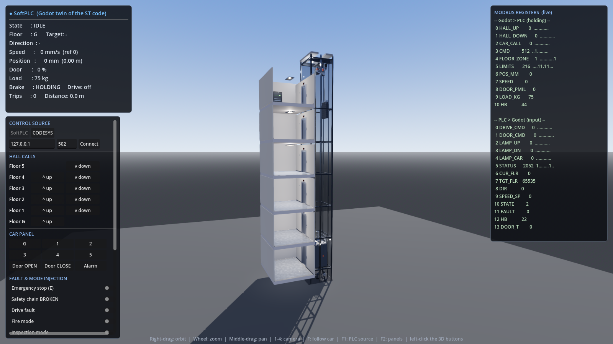
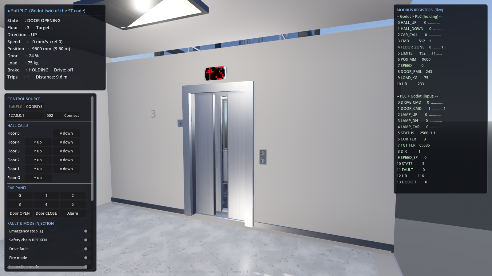
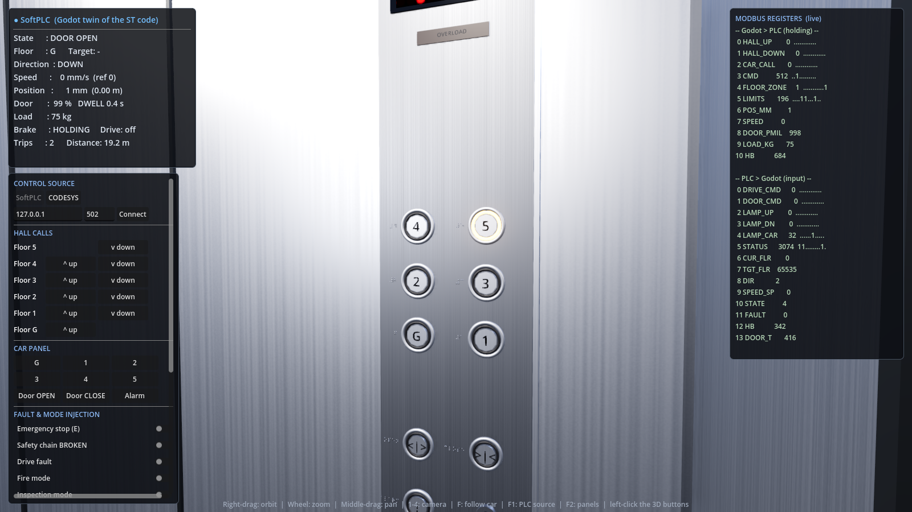
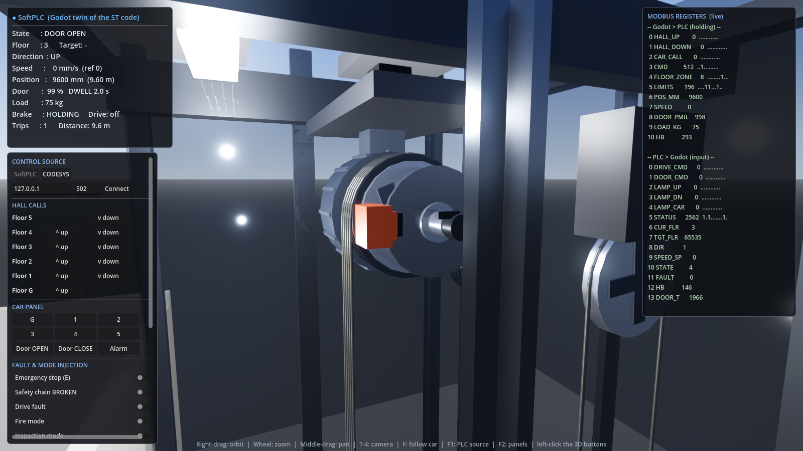

# Elevator Digital Twin — CODESYS + Godot

[](https://github.com/ErdemSabriVeli/elevator-digital-twin/actions/workflows/tests.yml)
[](LICENSE)
[](https://godotengine.org)
[](https://www.codesys.com)

A digital twin of a six-floor elevator. The **control logic runs in CODESYS as
Structured Text**; the **plant (car, doors, shaft, sensors) is modelled in 3D in
Godot 4**. The two talk over **Modbus TCP**, exactly like a real PLC talks to
field devices.

The same control logic is also transliterated to GDScript (`SoftPlc.gd`), so the
project runs end to end without CODESYS installed — and lets you compare the two
implementations against each other.

```
┌────────────────────────┐   Holding Reg (FC16)   ┌────────────────────────┐
│  GODOT 4  — plant      │  ───────────────────>  │  CODESYS — control     │
│  car / door physics    │   buttons, encoder,    │  FB_LiftCore (ST)      │
│  floor sensors         │   floor sensor, limits │  FSM + dispatcher      │
│  3D visualisation      │  <───────────────────  │  door + motion + safety│
│  operator UI           │   Input Reg (FC04)     │                        │
└────────────────────────┘   drive / door cmds    └────────────────────────┘
                             lamps, indicators
```

---

## Screenshots

All geometry, textures and sounds are generated in code at run time — there is
not a single model, texture or audio file in this repository.

| | |
|---|---|
|  |  |
| Six-floor shaft cutaway with car, counterweight and ropes | Stainless jamb, landing doors, red dot-matrix indicator |
|  |  |
| COP: round buttons with braille, amber halo when a call is registered | Gearless PM motor, grooved traction sheave, brake caliper, 5 ropes |

The panel on the left shows live PLC state; the table on the right shows the
**Modbus registers in both directions** in real time — everything on screen is
actual control data.

---

## Quick start (without CODESYS)

Godot 4.4+ required, no other dependencies. (Developed and tested on 4.4.1; CI
uses the same version.)

**Opening the project:** in the Godot project manager choose **Import** → pick
`godot/project.godot` from this repository → **Import & Edit**. Or directly:

```bash
godot --editor --path godot
```

> **The scene looks empty in the editor — that is expected.** `Main.tscn`
> contains a single `Node3D`; the shaft, car, landings, traction machine, ropes
> and the UI are **all built in code at run time** (`Main.gd → _ready()`).
> Press **F5** to see the elevator.

To run it without opening the editor at all:

```bash
godot --path godot
```

The project starts in **SoftPLC** mode — the GDScript twin of the ST code. Click
the 3D buttons in a landing or inside the car, or use the panel on the left.
**F12** takes a screenshot.

## Connecting CODESYS

[docs/codesys-setup.md](docs/codesys-setup.md) walks through it step by step. In short:

1. New CODESYS project → create the POUs from the `codesys/*.st` files.
2. Add **Ethernet → Modbus TCP Slave Device** to the device (port 502).
3. Match the `%IW0` / `%QW0` addresses in `GVL_IO` with the ones in your project.
4. Download to the PLC and start it.
5. In Godot: HUD → **CONTROL SOURCE → CODESYS** → enter the IP → **Connect**.
   (F1 toggles between SoftPLC and CODESYS.)

To start already connected from the command line:

```bash
godot --path godot -- --plc modbus --host 192.168.1.10 --port 502
```

---

## Layout

| Path | Contents |
|---|---|
| `codesys/` | Structured Text sources (the authoritative control logic) |
| `godot/scripts/` | 3D plant model, physics, Modbus client, ST twin |
| `godot/tests/` | ST lint, parity, geometry, scenario, protocol and braille tests |
| `docs/` | [I/O map](docs/io-map.md), [CODESYS setup](docs/codesys-setup.md), [demo scenarios](docs/demo-scenarios.md) |

### CODESYS POUs

| File | Role |
|---|---|
| `DUT_Types.st` | Enum and struct definitions |
| `GVL_Config.st` | Plant parameters (floor count, speeds, timings) |
| `GVL_IO.st` | Modbus register area + application structs |
| `FUN_Bits.st` | `F_GetBit` / `F_SetBit` |
| `FB_CallRegistry.st` | Call latching, lamp outputs |
| `FB_Dispatcher.st` | Collective control — target floor selection |
| `FB_DoorCtrl.st` | Door sub-state machine, light curtain, nudge |
| `FB_Motion.st` | Speed profile, levelling, floor tracking |
| `FB_Safety.st` | Safety chain, fault codes, reset |
| `FB_LiftCore.st` | Main state machine (15 states) |
| `PLC_PRG.st` | Modbus ↔ struct conversion + scan |

### Godot scripts

| File | Role |
|---|---|
| `Config.gd` | Shared constants — must match `GVL_Config.st` exactly |
| `IoMap.gd` | Register / bit map — must match `GVL_IO.st` |
| `SoftPlc.gd` | Line-by-line GDScript twin of the ST code |
| `Plant.gd` | Physics model: car, door, encoder, sensors |
| `ModbusTCPClient.gd` | Non-blocking Modbus TCP master (FC3/4/6/16) |
| `PlcLink.gd` | SoftPLC ↔ CODESYS selector, fallback on disconnect |
| `ShaftBuilder.gd` | Shaft, landings, landing doors, traction machine |
| `CarRig.gd` | Car, car door, control panel |
| `MaterialLib.gd` | Materials, procedural textures, mesh/arc helpers |
| `LedDisplay.gd` | Red dot-matrix indicator (car + every landing) |
| `Button3D.gd` | Clickable illuminated button, with its braille label |
| `Braille.gd` | Braille encoding + ADA dot geometry for the tactile signage |
| `CameraRig.gd` | Exterior / in-car / landing / machine cameras |
| `Hud.gd` | Status panel, live register table, fault injection |
| `AudioRig.gd` | Procedural audio synthesis (machine, door, gong, alarm, brake) |

---

## Modelled behaviour

**Dispatching:** collective control — calls in the direction of travel are
served in order, then the car reverses. After 30 s idle it returns to the
parking floor.

**Motion:** the controller produces a VVVF drive reference. Rated speed
1600 mm/s, deceleration ramp starting 2000 mm out, 150 mm/s creep inside the
door zone, stopping within ±8 mm.

On the plant side the drive applies a **jerk-limited (S-curve)** profile:
acceleration does not change instantly but at a bounded rate (1300 mm/s³). This
is why starts and stops feel smooth in a real elevator. Two engineering
couplings follow from it, both called out in the code:

- The deceleration distance (`C_DECEL_DIST_MM`) is sized against the drive's
  jerk-limited stopping distance — at 1400 mm the car overshot the floor by
  152 mm.
- The jerk limit is a **comfort** constraint; it is relaxed at creep speed,
  otherwise the car oscillates around floor level.

The brake is modelled as a friction element: it pulls speed to zero and holds
it there, and can never drive the car backwards. It responds to the command
with a 150 ms delay.

**Load compensation (pre-torque).** A gearless machine holds the car by
friction on the sheave, so the moment the brake lifts the only thing opposing
the load is motor torque. The counterweight is sized at the empty car plus half
the rated load (a 50 % balance factor), which means the leftover imbalance
*changes sign* as the car fills: 1200 kg empty car, 1515 kg counterweight, so a
full car is 315 kg heavy and an empty one 315 kg light.

The controller reads the load cell and sends the drive a pre-torque reference
(register 14, signed per mille) before the brake opens, and it enables the
drive a start delay ahead of the brake so the torque is actually there. Turn
the compensation off in the fault-injection panel and the model does what an
uncompensated lift does: **a full car sinks ~40 mm and an empty one is pulled
up ~27 mm** at the instant of release, before the speed loop catches it.

**Doors:** open → dwell (4 s on a car call, 3 s on a hall call) → close. The
light curtain or the door-open button reopens them; overload holds them open.
After 15 s "nudge" (slow forced closing) kicks in. The panels are driven with a
velocity envelope that slows near both ends and speeds up in the middle — a real
door operator does the same to protect the mechanism and avoid slamming.

**Safety:** emergency stop, safety chain, terminal limit switches, loss of door
lock, door / travel timeout, encoder–floor-sensor mismatch, plus:

- **Overspeed (governor), two stages.** These are two separate devices and the
  model treats them that way. At 115 % of rated (1840 mm/s, held 0.3 s) the
  governor's electrical contact opens and the controller is expected to stop
  the car itself. If it cannot — a drive running away faster than the
  controller can confirm and react — the governor grips its rope at 125 %
  (2000 mm/s) and that pulls the **safety gear** wedges onto the guide rails.
  The wedges only bite downwards, which is why they answer a falling car and
  not one overspeeding upwards; they slip at about 0.6 g rather than stopping
  the car dead. A set safety gear is fault 11 and **RESET will not clear it** —
  on a real lift the wedges have to be freed by hand at the car, so here that
  is a separate button rather than something the control logic can do.
- **Brake feedback:** faults when the PLC's brake-release command and the field
  brake contact disagree for 1 s. In the plant the brake responds with a 150 ms
  delay, so the supervision tolerates a realistic lag.

Faults latch; a reset is only accepted once the cause is gone.

**Alarm bell:** the car alarm button is momentary; the bell keeps ringing for
2 s after the press (`TOF` on the ST side, an equivalent class in the twin). The
button halo stays lit while it rings.

**Special modes:** fire (all calls cleared, car sent to the evacuation floor,
doors held open), inspection (car-top hold-to-run, 300 mm/s), overload (start
inhibit).

**Link supervision:** Godot sends a heartbeat every scan. If it stops changing
for 2 s the PLC treats the safety chain as open and refuses to move the car.

---

## Visual model

Car and landing fronts are modelled after a modern elevator; all geometry and
textures are generated in code at run time (no external asset files).

**Materials** — `MaterialLib.gd`
- Brushed stainless (satin inox): metallic 0.96, with a procedural *roughness*
  texture giving a fine unidirectional brush grain. Car walls, doors, jambs, COP
  plate.
- Mirror: on the car's rear wall, faint green glass tint, with real reflections
  from an in-car reflection probe.
- Dark granite car floor and light marble landing floor: speckle / vein textures
  are generated procedurally.

**Car interior**
- Round stainless handrail at 900 mm (rear + both sides), stainless skirting
- White false ceiling, 4 recessed downlights (each with its own light source)
  and a perimeter light band
- Side walls with reveal-lined panels

**COP (car operating panel)** — on the right front return wall
- Red dot-matrix indicator at the top, overload warning strip beneath it
- Two columns of round buttons (bottom-up G→5)
- Real braille to the left of every button — floor numbers carry a number
  sign, so "3" is two cells, and the door and alarm buttons are labelled too.
  Dot size, height and spacing follow ADA 703.3 / BANA, which is an ergonomic
  spec rather than styling: dots outside it cannot be read by touch.
- Door open / door close / alarm, key switch, emergency phone grille
- Car capacity plate (630 kg / 8 persons)

**Buttons** — `Button3D.gd`
- Stainless bezel + slightly recessed brushed cap + engraved numeral
- When a call is registered the halo around the cap lights **amber** (driven by
  the PLC lamp bit)
- Cool grey preview on hover, press animation on click

**Indicators** — `LedDisplay.gd`
- True dot matrix: 5×7 character font with a direction arrow on the left
- The texture is drawn at run time (lit LED bright red, unlit LED dark red) and
  regenerated only when the content changes
- Blinks on a fault, shows `F` in fire mode and `R` in inspection

**Landing**
- Stainless jamb, two-panel satin doors, stainless sill and skirting
- LED indicator above the door, floor number plate beside it
- Call station: two round buttons on a stainless plate
- Recessed ceiling luminaire

**Traction system (motor + ropes)** — `ShaftBuilder.gd`

Machine-room-less (MRL) arrangement; the whole suspension chain is modelled:

| Component | Model |
|---|---|
| Traction machine | Gearless permanent-magnet (PM) disc motor, 16 radial cooling fins, terminal box |
| Traction sheave | R = 320 mm, a separate groove per rope (separated by flanges), 6 web holes |
| Brake | Steel brake disc + two electromagnetic calipers; each caliper presses a pad on both disc faces |
| Encoder | On the shaft end, position feedback |
| Deflector sheave | R = 190 mm; carries the line coming off the sheave to the counterweight line |
| Suspension ropes | 5 parallel steel ropes, 36 mm groove pitch, 1:1 roping |
| Rope hitches | Plate on top of car and counterweight + a compression spring and socket per rope |
| Overspeed governor | Closed rope loop in the rear shaft corner, tension pulley in the pit, clamp linked to the car |
| Counterweight | Weight slabs + suspension frame + guide rails |

The rope routing is geometrically consistent (see `tests/geometry_test.gd`):

```
car hitch (z=0) ─ vertical ─▶ 180° wrap over the traction sheave
                                      │
                            vertical (z=-0.64)
                                      ▼
                        180° wrap over the deflector sheave
                                      │
                            vertical (z=-1.02) ─▶ counterweight hitch
```

The wraps over the sheaves are static geometry; only the length of the vertical
runs is updated each frame. The sheave, brake disc, deflector, governor and
tension pulley all rotate with rope speed (each scaled by its own radius). The
brake pads retract from the disc according to the PLC's **brake-release** output.

**Audio** — `AudioRig.gd`

Every sound is synthesised at run time (no external audio files) and **driven
from PLC outputs** — what you hear is the actual controller state, not
animation garnish. The sources are positional:

| Sound | Source | Driving signal |
|---|---|---|
| Machine hum | shaft head | speed (pitch and level follow it) |
| Door motor | car | door open/close command |
| Arrival gong | car | `STATUS.gong` bit |
| Alarm bell | car | `STATUS.alarm` bit |
| Brake click | car | brake state change |

**Lighting / rendering**
- ACES tonemap, screen-space reflections (SSR), SSAO, restrained glow
- A `ReflectionProbe` (interior) inside the car so the mirror and stainless
  surfaces reflect the car itself rather than the shaft

---

## Controls

| Key / mouse | Action |
|---|---|
| Left click | Press a 3D button |
| Right click + drag | Orbit the camera |
| Middle click + drag | Pan |
| Wheel | Zoom in / out |
| `1` `2` `3` `4` | Exterior / in-car / landing / machine camera |
| `F` | Follow the car |
| `Home` | Frame the whole building |
| `F1` | SoftPLC ↔ CODESYS |
| `F2` | Show / hide panels |
| `E` / `R` | Emergency stop / fault reset |
| `O` / `C` | Door open / close |
| `PgUp` / `PgDn` | Up / down in inspection mode |
| `F12` | Screenshot (`%APPDATA%\Godot\app_userdata\...`) |

### Fault injection (switches in the left panel)

Each one imitates a real failure in the plant model; the PLC is expected to
detect it from its own inputs.

| Switch | What happens | Expected fault |
|---|---|---|
| Emergency stop | Safety chain is cut | 8 — Emergency stop |
| Safety chain BROKEN | Chain contact opens | 1 — Safety chain |
| Drive fault | Drive-ready signal drops | 4 — Drive |
| Brake stuck | No brake contact despite the release command | 9 — Brake feedback |
| Drive runaway | Actual speed climbs to 120 % of the reference | 10 — Overspeed |
| Severe runaway | 145 % — past the governor's mechanical trip before the controller can react | 11 — Safety gear set |
| Car jammed | Drive runs but position does not advance | 3 — Travel timeout |
| Rope slip | Encoder drifts from the true position | 6 — Encoder mismatch |
| Light curtain | Door permanently obstructed | (not a fault — the door reopens) |
| No load compensation | Drive ignores the pre-torque reference | (not a fault — the car rolls back at the start) |

---

## Performance

The scene runs at ~135 FPS at 1600×900. There is a built-in profiling mode:

```bash
godot --path godot -- --profile 8
```

It prints draw calls, triangles, node/resource counts, video memory and the
time spent in each of the four stages of `_physics_process` separately.

Measurement-driven improvements:

| | Before | After |
|---|---|---|
| Draw calls | 2907 | 714 |
| Triangles | 804 k | 519 k |
| Script time (frame) | 1.21 ms | 0.52 ms |
| Video memory | 480 MB | 425 MB |

- **Mesh sharing:** meshes of identical size share a single resource. Critical
  for the hundreds of rope-arc segments and repeated details. Meshes that are
  mutated afterwards (the dynamic rope runs) are excluded from sharing — the
  5 ropes on one side are always the same length anyway, so they share one mesh
  and the frame updates 2 meshes instead of 10.
- **Shadow culling:** parts smaller than 26 cm cast no shadow. The shadow pass
  redraws the geometry several times, which is where most draw calls came from.
  The directional light's shadow distance was tightened to the building height
  (42 m).
- **Change guards:** `set_light` / `set_overload` / `set_panel_leds` are called
  every frame but now only touch materials when the state actually changes.
- **UI rate limit:** the HUD updates at 15 Hz instead of 60 Hz (building the
  register table's text is not worth doing per frame).

---

## Tests

All six run headless with no dependency beyond Godot.

```bash
godot --headless --path godot --script res://tests/st_lint_test.gd
```

**ST static lint.** `codesys/*.st` cannot be compiled without CODESYS; this
check catches most of what the compiler would, straight from the source: block
balance (`IF`/`CASE`/`FOR`/`VAR_*`/`METHOD`), undefined `C_*` constants,
undefined enum literals, struct fields that do not exist in `stIn.`/`stOut.`,
calls to FB methods that do not exist, and wrong parameter names in FB calls.

What it does not do: type checking, expression correctness, real compilation —
those can only be verified by compiling in CODESYS.

```bash
godot --headless --path godot --script res://tests/parity_test.gd
```

**ST ↔ GDScript parity test.** The biggest risk in this architecture is the two
copies of the control logic (`codesys/*.st` and `godot/scripts/*.gd`) silently
drifting apart — once they do, the twin no longer represents the real PLC and
that is very hard to notice. The test parses the ST source and compares:
`GVL_Config.st` constants (27), `DUT_Types.st` enums (35 values) and the bit
indices in `PLC_PRG.st` (32 bits).

```bash
godot --headless --path godot --script res://tests/sim_test.gd
```

13 scenarios: car call and levelling, collective control, emergency stop +
reset, overload start inhibit, fire evacuation (including a regression for the
doors staying open), light curtain, travel timeout and recovery from a fault,
brake feedback, overspeed, gong duration + alarm bell, ride quality (jerk and
acceleration limits verified by measurement), load compensation (pre-torque sign, and
the rollback that appears when it is switched off), and the safety gear (the
governor gripping, the car held on the rails, and that RESET will not clear it).

```bash
godot --headless --path godot --script res://tests/modbus_test.gd
```

Modbus TCP protocol test: a real TCP slave is brought up and FC16 write / FC04
read frames are verified end to end.

```bash
godot --headless --path godot --script res://tests/geometry_test.gd
```

Mechanical layout verification — catches collisions that are hard to spot in a
screenshot, numerically: alignment of the rope lines with the car and
counterweight centres, clearance between the traction sheave / deflector and the
car-top guard rail with the car at the top floor, the counterweight's pit buffer
and upper limit, car–counterweight horizontal separation, and the governor
rope's distance from the car and the door zone.

```bash
godot --headless --path godot --script res://tests/braille_test.gd
```

**Braille signage.** Wrong braille still looks like plausible dots in a
screenshot, so this reads the raised dots back out of the built 3D panel and
decodes them. It checks the encoding against the standard (written out
literally in the test, so it cannot just agree with the renderer), that digits
carry a number sign — without it "3" reads as the letter "c" — that no two
buttons share a pattern, that dot size and spacing sit inside ADA 703.3 / BANA,
and that each block fits the panel and clears its neighbour.

---

## Changing parameters

Floor count, floor height, speeds and timings are defined in **two places** and
must stay identical:

- `codesys/GVL_Config.st`
- `godot/scripts/Config.gd` (upper section)

Change one and forget the other and the digital twin behaves differently from
the real PLC — that is what the warning note in `Config.gd` is for. When you
change the floor count the 3D scene rebuilds itself automatically; the register
map supports up to 16 floors.

After a change, run the parity test; if the two sides have drifted it tells you
exactly which constant does not match:

```bash
godot --headless --path godot --script res://tests/parity_test.gd
```

---

## Known limitations

To be straight about it, this is the part of the project that is not verified:

- **The ST code has never been compiled.** `codesys/*.st` cannot be built
  without CODESYS; in this repository it only passes the static lint
  (`st_lint_test.gd`). The lint verifies syntax, symbol resolution and FB
  interfaces but **does no type checking**. Do not be surprised by warnings on
  the first build.
- Single-car system — group control (a shared dispatcher across several
  elevators) is not modelled.

---

## License

MIT — see [LICENSE](LICENSE).
